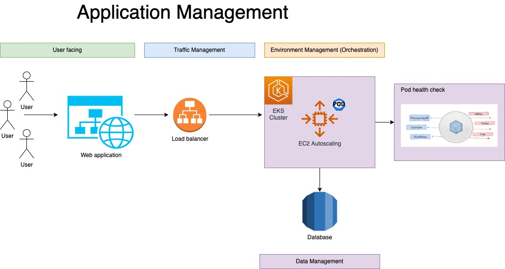
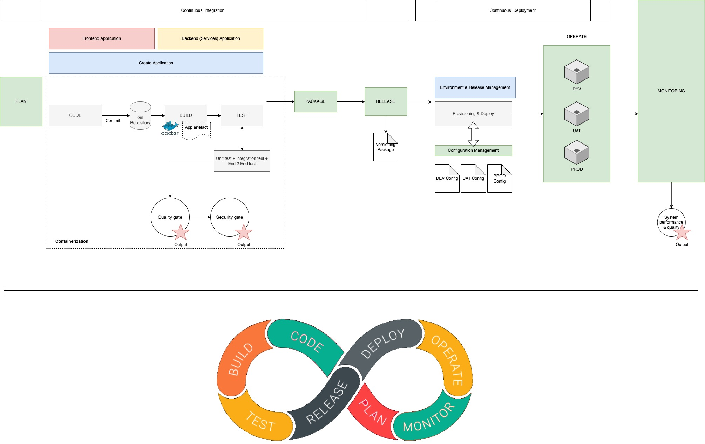

# Homework 1 : Application Management

### Application Management Architecture :

จากรูป การจัดการ Application มีเป้าหมายมาจาก User ต้องการเข้าใช้งาน Web application ผ่านทาง Web browser ต่าง ๆ โดยเมื่อ User เข้ามา เราจะมีสิ่งที่เรียกว่า Load Balance ซึ่งมีหน้าที่เป็นด่านหน้าในการจัดการแอปเพื่อให้รองรับผู้ใช้งานได้ในปริมาณมากขึ้น โดยเจ้าตัว Load balancer ทำหน้าที่ในการ guide นำทางพาคน ไปจุดที่ต้องการ ในขณะที่ ฝั่ง K8S (หรือดังภาพใช้ Product ของ AWS ที่ชื่อว่า EKS เป็นตัวแทน) จะทำหน้าที่ ในการ orchestration เพื่อเพิ่ม หรือลด จำนวน Application ไปตามปริมาณของ Traffic แทน Operation team ซึ่งทำหน้าที่ในการ Scale เพิ่ม ลด resource ได้ automatically จึงทำให้ Kubernetes มีจุดเด่น และเริ่มทำมาใช้งานอย่างแพร่หลายในปัจจุบัน

หลังจากเราเข้าใจกระบวนการจัดการของ Application แล้วนั้น ส่วนสำคัญที่จะทำให้เกิดภาพเหล่านี้คือ Process การจัดการ Application ดังหัวข้อด้านล่าง ไปติดตามได้เลยค่ะ

### Application Management Process :

ในส่วนมุมมองของการพัฒนา Application จะต้องมีการคำนึงในเรื่องของ Deployment Process ดังรูป

ในทุก stage ของการ Deploy Application ซึ่งในที่นี้ Application ของเรามีการใช้กระบวนการ Containerization ทำให้ง่ายต่อการจัดการ และ manage โดยที่ทุกอย่างจะทำโดยอัติโนมัติผ่านกระบวนการที่เรียกว่า Continueous Integration and Continuous Deployment หรือ CI/CD และเป็นส่วนหนึ่งของ Cloud Native Technology 

ดังนั้น กระบวนการนี้จะต้องมี การทำ build, test และ release version เก็บไว้เสมอ ๆ เพื่อทำให้การพัฒนาเกิดความต่อเนื่อง เเละรวดเร็วต่อการพัฒนา และการแก้ไขความผิดพลาดใช้ หรือที่เรียกว่า Fast Feedback ทั้งยังสามารถ Role back ได้ทันท่วงที เมื่อเกิดการ Release Software ที่ผิดพลาด หรือด้อยคุณภาพ รวมถึงสามารถ Publish สู่ Environment ได้อย่างรวดเร็ว และตอบโจทย์ความต้องการเชิง Busimess ได้อีกด้วย เช่นเมื่อเกิดการสเกลของธุรกิจ โดยคำนึงถึง observability ที่จะเกิดขึ้นภายใต้สิ่งแวดล้อมที่มีอยู่

นอกจากนี้ กระบวนการเหล่านี้ ยังเกิดจากสิ่งที่เรียกว่า "DevOps mindset or culture"